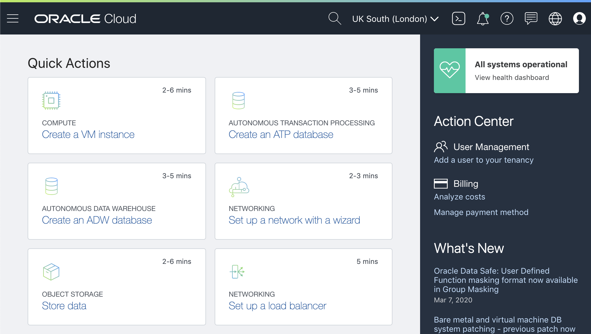

# Oracle Autonomous Transaction Processing

## Getting Started for developers and operators

This workshop walks you through all the steps to get started using the **Oracle Autonomous Transaction Processing** (ATP).

Oracle Autonomous Transaction Processing delivers a self-driving, self-securing, self-repairing database service that can instantly scale to meet demands of mission critical transaction processing and mixed workload applications.

## Who Should Read This Workshop

You want to **develop applications** that connect to Oracle Databases in the Cloud.

You want to **manage Oracle Autonomous databases** in Oracle Cloud.

You are also interested in exploring other technologies to build **Cloud Native applications**.

## Requirements

In order to walk through this workshop you need an **active Oracle Cloud Account**. If you don't have one:

[>> Please Sign-Up a Free Tier Oracle Cloud account <<](http://bit.ly/34TzwGf)

> It takes few minutes to fully-provision your account.

After you log-in in your Oracle Cloud Account, you should see the web console, like this:

At this point, you are ready to start learning!

---

## Content

[Lab 100: Create an Autonomous Database](lab100/README.md)

- Create you Autonomous Database
- Download your Wallet
- Use Web SQL Developer

[Lab 200: Set up a Virtual Machine](lab200/README.md)

- Create your Virtual Cloud Network
- Create your linux instance
- Configure OCI command line tool

[Lab 300: DevOps with ATP](lab300/README.md)

- Metrics of your Autonomous Database
- Explore Autonomous database with the command line

[Lab 400: Node.js App Using ATP](lab400/README.md)

- Execute your Node app
- Explore the code

[Lab 500: JAVA App Using ATP](lab500/README.md)

- Execute your JAVA app
- Explore the code

[Lab 600: Programmatically Talking to Oracle Cloud](lab600/README.md)

- Execute your SDK JAVA app
- Explore the code

[Lab 700: Building containers Using ATP](lab700/README.md)

- Build your Node app container
- Run it locally

---

## Let's Get Started!

Create your Autonomous Database: [**Go To Lab 100!**](./lab100/README.md)

> If you have alreadt an Autonomous database, you can [Go to Lab 200](./lab200/README.md) directly.
