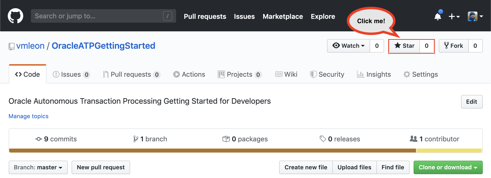

# Appendix

If you enjoy the workshop, give me a star on Github: [click here](https://github.com/vmleon/OracleATPGettingStarted)!

Please, help us to improve. [Create an issue](https://github.com/vmleon/OracleATPGettingStarted/issues) if you think something is not quite right.

---

## Want more?

Learn Kubernetes with [Oracle Kubernetes Engine (Workshop)](https://github.com/vmleon/OKE-first-steps)

Learn about HTTP security with [Oracle Cloud Web Application Firewall (Workshop)](https://github.com/vmleon/Oracle-WAF-Demo)

---

## Troubleshooting

### Lab400

Running node app give me `Error: DPI-1047: Cannot locate a 64-bit Oracle Client library`

- LD_LIBRARY_PATH not exported properly
- Instant Client 12.2 not installed on `/opt/oracle`

Running node app gives me `ORA-12154: TNS:could not resolve the connect identifier specified`

- `.env` file contains an incorrect name for `DB_STRING`. It is case sensitive.

---

[**<< Prev**](../lab600/README.md) | [home](../README.md)
