# Lab 200: Set up a Virtual Machine

Create a virtual machine in Oracle cloud allow you to have a consistent environment where you can test applications, and manage operations. It is the foundation of any system. And with Oracle Cloud it is very easy.

## Before you start

We are going to SSH into our new Linux instance. For that we need public and private SSH key.

If you don't have one, please go ahead and follow the steps on the official documentation:

Oracle Cloud Docs: [Connecting to an Instance](https://docs.cloud.oracle.com/en-us/iaas/Content/Compute/Tasks/accessinginstance.htm)

## Create your Virtual Cloud Network

Network is the foundation of any cloud resource. They all need to be connected and they live on a **Virtual Cloud Network (VCN)**.

Let's create our VCN
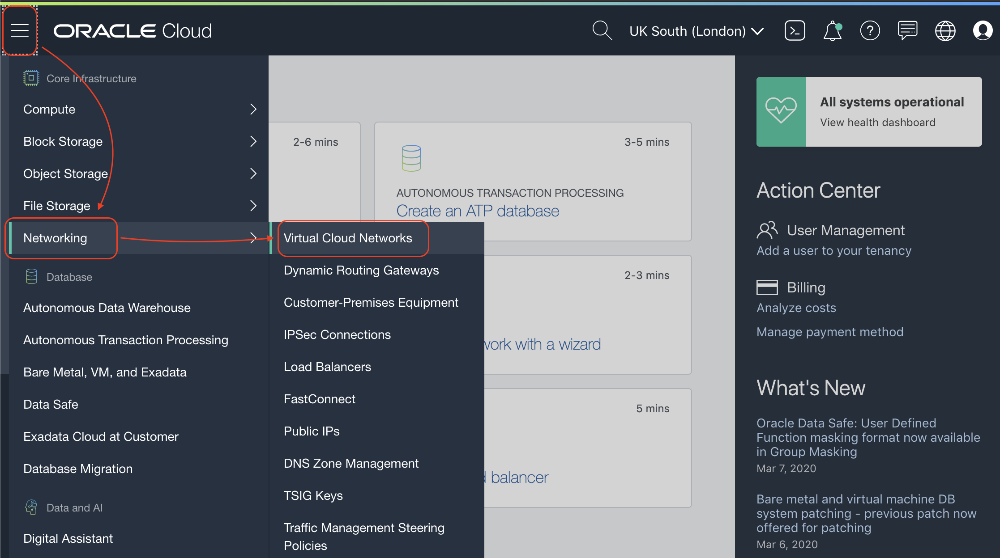

Click in **Networking Quickstart** button
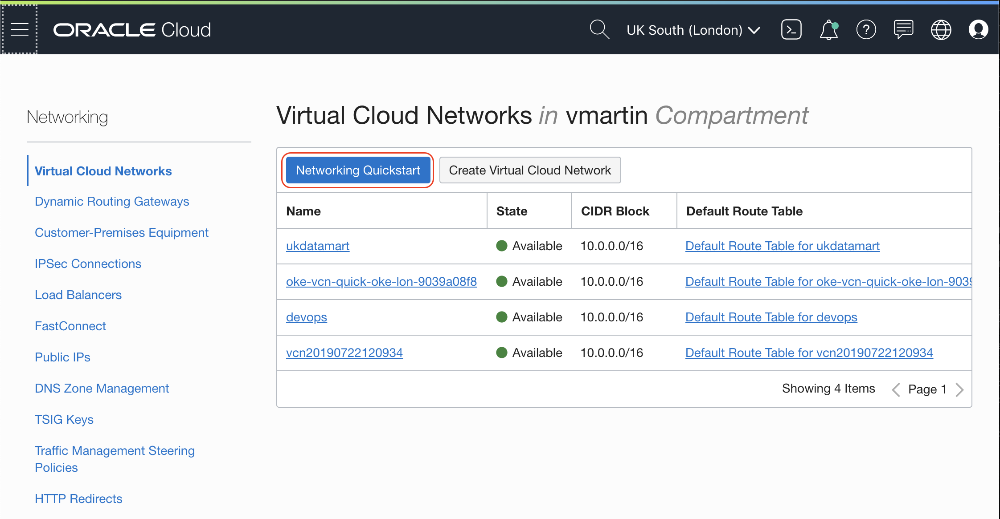

Select **VCN with Internet Connectivity** button, then **Start Workflow** button
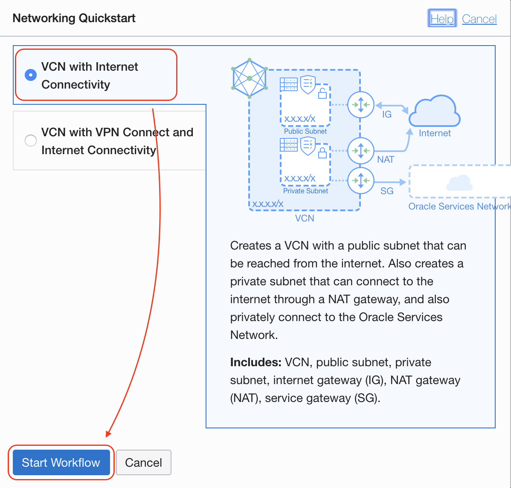

Give a **VCN Name**, **VCN CIDR Block** and **Public** and **Private Subnet Block**s, then click **Next** button
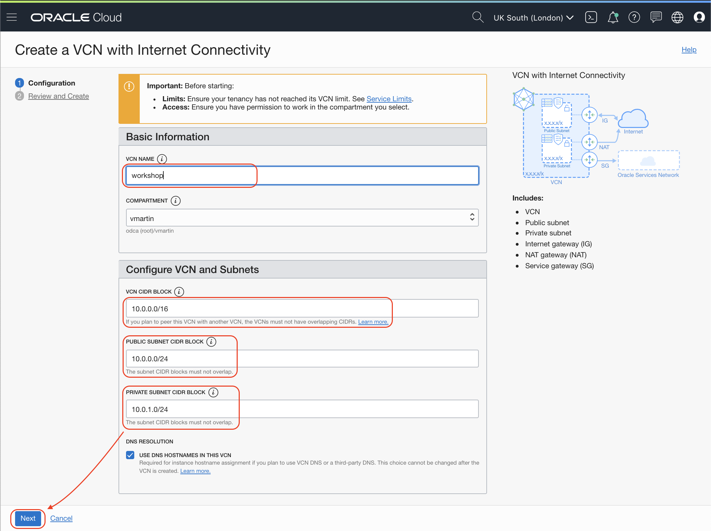

Finally, review the information and click **Create** button
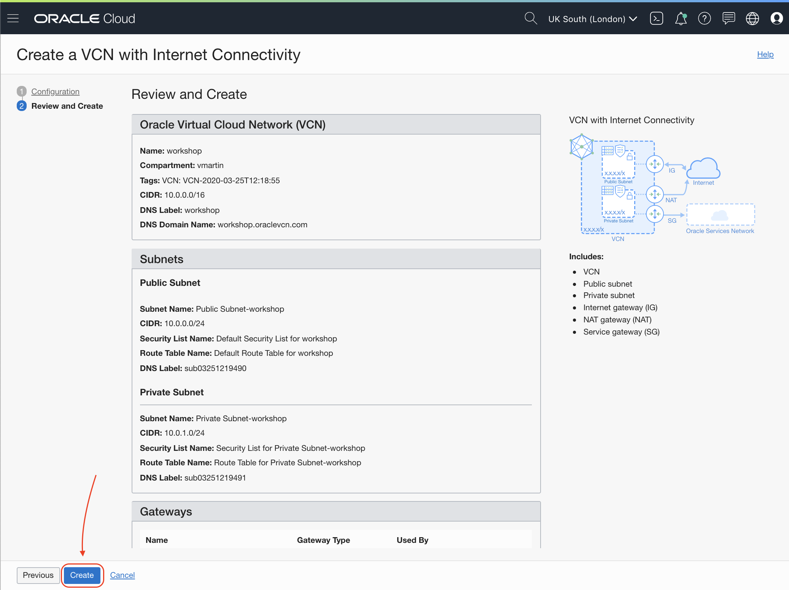

Instantly your Virtual Cloud Network will be available.

Ready to create your new Linux machine in the cloud.

## Create your Linux instance

Let's create our Linux machine in Oracle Cloud

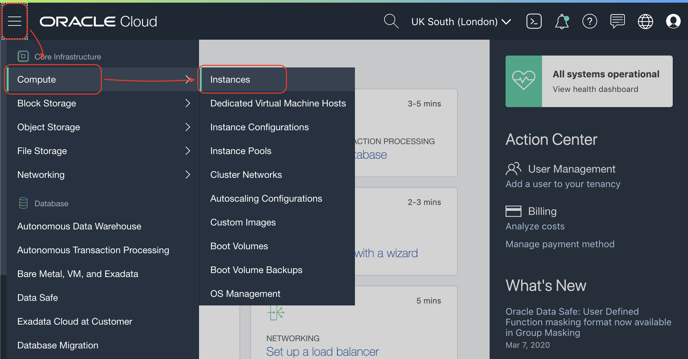

Click **Create Instance** button
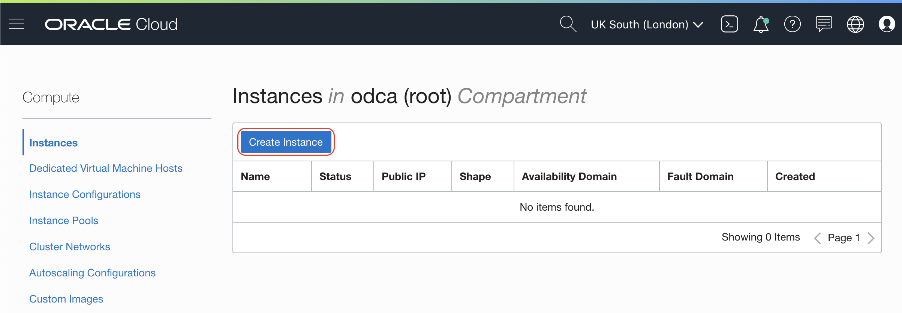

Set **Name your instance** field and make sure you select **Virtual Machine** Instance Type
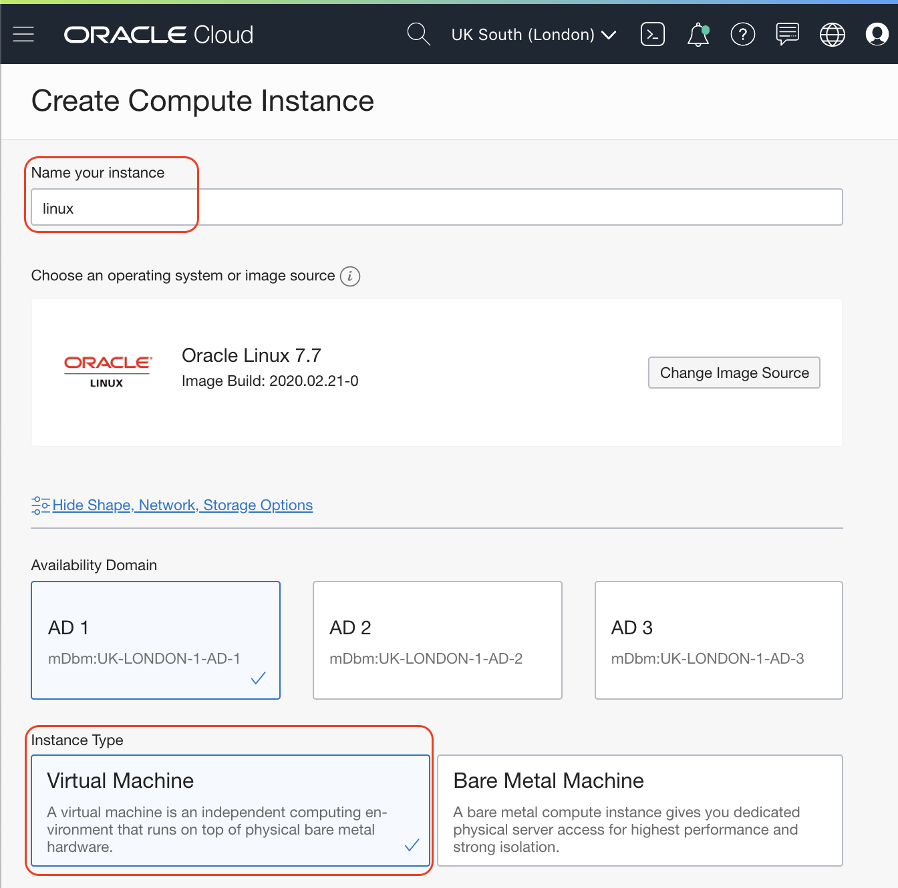

In the **Configure networking** section make sure you select the **VCN** you created on the previous step and also make sure you select the **PUBLIC Subnet**. My network is called _ukdatamart_.

> It is very important you select the **PUBLIC SUBNET** or you won't be able to connect through SSH into your virtual machine.

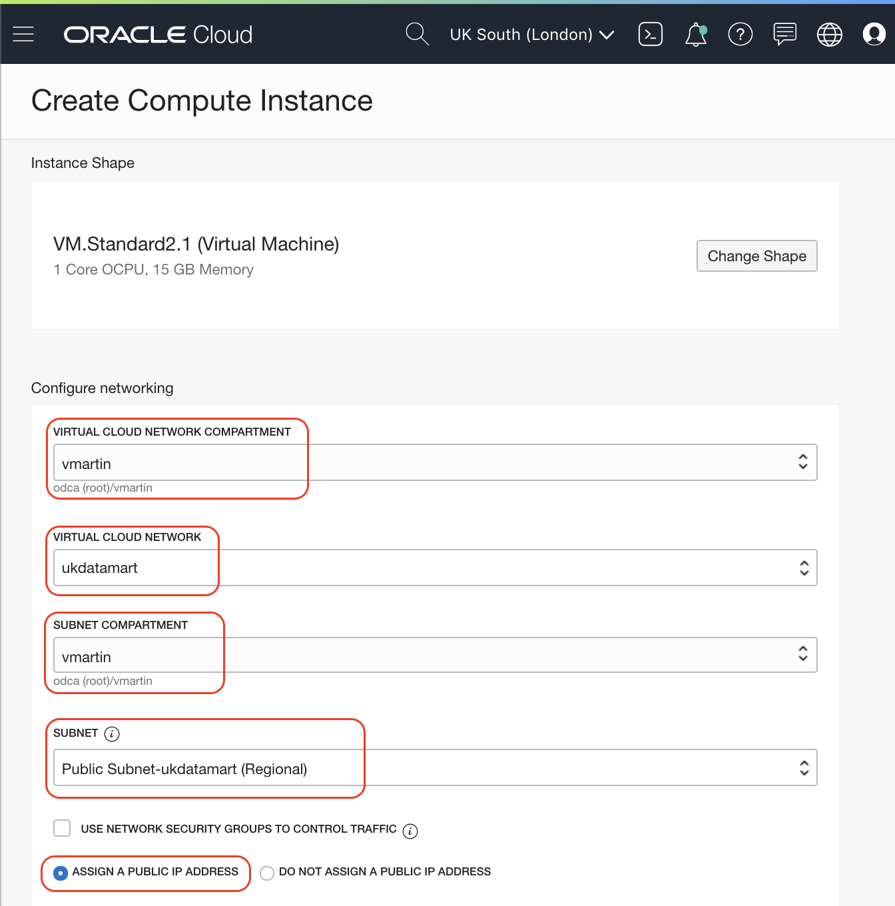

Time to use your public SSH key. You can either select the file to upload or paste the value selecting **PASTE SSH KEYS**.

Finally, click in **Create** button
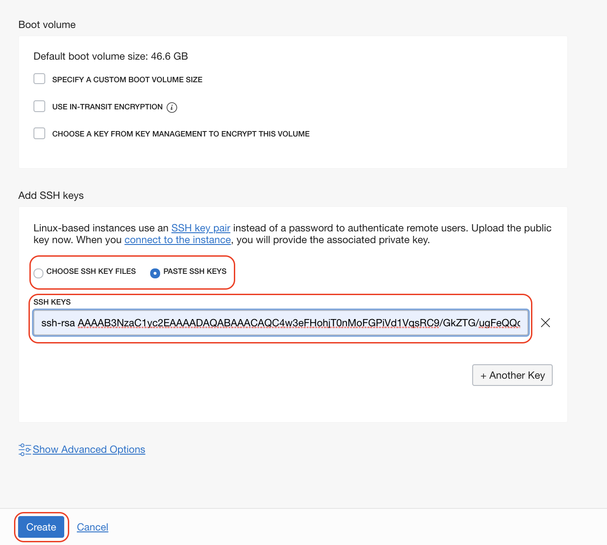

It will take few seconds, sometimes few minutes to provision the new virtual machine depending on the shape.
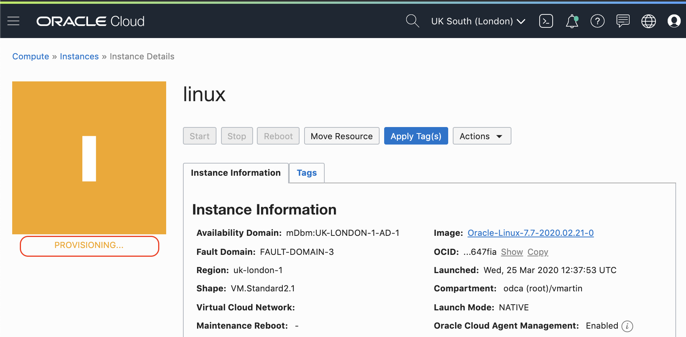

Soon you will see the machine provisioned and the Public IP address in the details section.
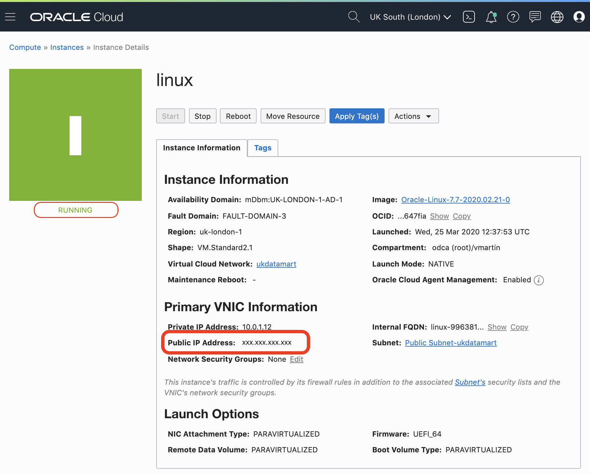

## It works

SSH into the machine:

`ssh opc@<public_IP>`

> Windows users: Download and configure [Putty](https://www.putty.org/)

The connection process will ask you if you want to continue the connection, answer `yes` if all the information is correct.

> If you have your public key in other location than the default one:
>
> `ssh -i /path/to/public/key.pem opc@<public_IP>`

You should see something like this:

```
$ ssh opc@<xxx.xxx.xxx.xxx>
The authenticity of host '<xxx.xxx.xxx.xxx> (<xxx.xxx.xxx.xxx>)' can't be established.
ECDSA key fingerprint is SHA256:gI+qhiiJsXikTENrfQsC7pwuCsbbVy7R0LXrqawInLc.
Are you sure you want to continue connecting (yes/no)? yes
Warning: Permanently added '<xxx.xxx.xxx.xxx>' (ECDSA) to the list of known hosts.
```

Congratulations! You are ready to go to the next Lab!

---

[**<< Prev**](../lab100/README.md) | [home](../README.md) | [**NEXT >>>>>**](../lab300/README.md)
