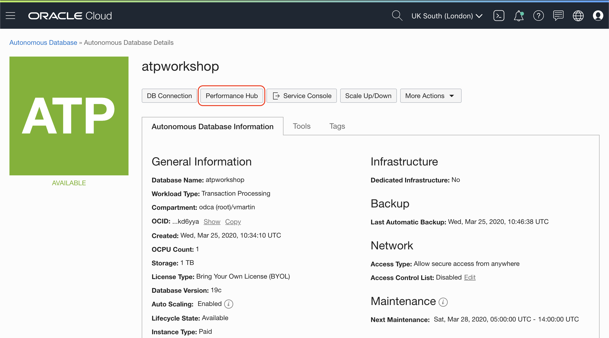

# Lab 300: DevOps with ATP

Autonomous Databases give you the opportunity to see metrics and other services like Machine Learning and Oracle Application Express. You can also interact with Oracle Cloud with a command line tool. We are going to explore it in this Lab.

## Before you start

It is required that you are logged in the Linux machine.

## Configure OCI command line tool

Learn more from the [official documentation](https://docs.cloud.oracle.com/en-us/iaas/Content/API/Concepts/cliconcepts.htm) about OCI CLI tools.

We are going to do a quick installation to get everything up and running.

In your Linux terminal, execute the following command to download and start the installation:

```bash
bash -c "$(curl -L https://raw.githubusercontent.com/oracle/oci-cli/master/scripts/install/install.sh)"
```

Respond all the questions on the terminal, default values are good for the workshop.

It will download some packages and get everything ready.

Check the installation worked:

```
oci -v
```

It should give you the version number of the OCI CLI tool.

Before using the CLI, you must create a config file that contains the required credentials for working with Oracle Cloud Infrastructure.

To have the CLI walk you through the first-time setup process, use the `oci setup config` command. The command prompts you for the information required for the config file and the API public/private keys. The setup dialogue generates an API key pair and creates the config file.

We need some information that the config script will ask:

### Tenancy OCID


Click the **Copy** link


### User OCID


Click the **Copy** link


We are ready to run the config helper:

```bash
oci setup config
```

It will ask for User OCID, Tenancy OCID and region. For the region, I'm using `uk-london-1` but you can pick the one you have on the title bar here:


Everything else, default values. Press `Enter` to accept default values.

You know it worked if you see something like this:

```
Public key written to: /home/opc/.oci/oci_api_key_public.pem
Enter a passphrase for your private key (empty for no passphrase):
Private key written to: /home/opc/.oci/oci_api_key.pem
Fingerprint: a1:b2:c3:a1:b2:c3:a1:b2:c3:a1:b2:c3:a1:b2:c3:a1
Config written to /home/opc/.oci/config


    If you haven't already uploaded your API Signing public key through the console, follow the instructions on the page linked below in the section 'How to upload the public key':

    https://docs.cloud.oracle.com/Content/API/Concepts/apisigningkey.htm#How2
```

Final step, I promise. We have to upload the Public Key generated by OCI CLI setup to Oracle Cloud:

In the terminal, if you left the default path for your public key:

```bash
cat /home/opc/.oci/oci_api_key_public.pem
```

Copy the result of the command and go back to the web console.


Paste the public key you copied from the terminal and click **Add** button


Check everything is working, come back to the terminal and request the name of your tenancy with the OCI CLI:

```bash
oci os ns get
```

You should get something like this:

```json
{
  "data": "tenancy_name"
}
```

Well done!!

## Explore Autonomous database with the command line

We know now how to use the OCI CLI tool to talk to Oracle Cloud. Let's explore some specific commands for Autonomous Database.

First, we need the compartment OCID, as we did before for Tenancy and User OCID


On your terminal, list the Autonomous Databases in your root compartment

```bash
oci db autonomous-database list -c <compartment_ocid>
```

Boom! A long JSON file is the output. Let's do some cleaning to see the names of the databases. I have 2 databases on my compartment, you should see at least the one you created. In your Terminal:

```bash
oci db autonomous-database list -c <compartment_ocid> | jq '.data[]."display-name"'
```

I got two database names. Magic!

```bash
"atpworkshop"
"Playground"
```

Learn more of OCI CLI with the help

```bash
oci -h
```

## Metrics of your Autonomous Database

Come back to your Oracle Cloud Web Console. In the details page of your Autonomous Database.


Scroll down to the bottom and see some generic metrics


For more details, click on Performance Hub button at the top


Performance Hub will give your more insights about what is happening inside your database


## It works

You installed the CLI tool to talk to Oracle Cloud.

Also inspect some metrics of Autonomous Database.

Congratulations! You are ready to go to the next Lab!

---

[**<< Prev**](../lab200/README.md) | [home](../README.md) | [**NEXT >>>>>**](../lab400/README.md)
