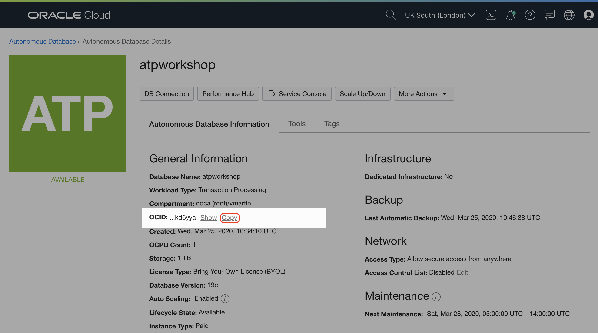
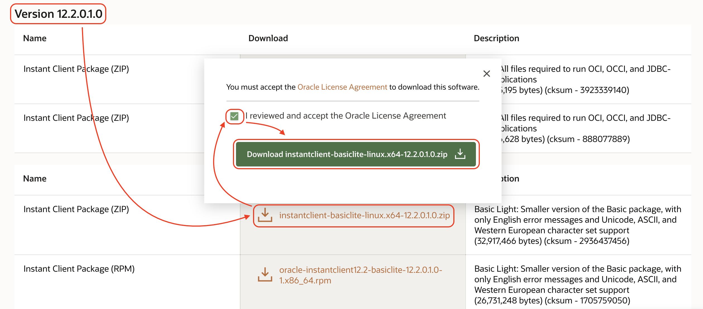

# Lab 400: Node.js App Using ATP

Node.js is a pretty popular language for prototyping applications and build APIs. As part of this workshop we include some code in different language for you to play around. You can find the code for the Node.js Application on this [Github repository](https://github.com/vmleon/OracleATPGettingStarted/tree/master/src/node).

## Before you start

We are going to connect to the Autonomous Database so the first step is to get the Wallet file in the Linux machine. We will use the same file as well for the JAVA application.

We need the Autonomous Database OCID, same as we have done with other entities


In your terminal, use your amazing OCI CLI tool to get the wallet file.

```bash
oci db autonomous-database generate-wallet --file wallet.zip --password WelcomeATP123! --autonomous-database-id <atp_ocid>
```

As the last step, remember to unzip the wallet file.

```bash
unzip -d wallet wallet.zip
```

Any Linux in order to communicate with Oracle Databases with performance and security needs to have some libraries.

Download and install from [Oracle Technology Network](https://www.oracle.com/technetwork/topics/linuxx86-64soft-092277.html).

Scroll down until you see `Version 12.2.0.10` and download the `basiclite` version.


From the directory where the downloaded file is, secure copy the file to our linux machine. Replace `<public_ip>` with the public IP of the Linux machine.

```bash
scp ./instantclient-basiclite-linux.x64-12.2.0.1.0.zip opc@<public_ip>:/home/opc
```

From the terminal on you Linux machine, unzip the instant client library. And move it to the final location.

```bash
unzip instantclient-basiclite-linux.x64-12.2.0.1.0.zip

sudo mkdir /opt/oracle

sudo mv instantclient_12_2 /opt/oracle
```

This library should be added to the dynamic libraries environment variable `LD_LIBRARY_PATH`:

```bash
export LD_LIBRARY_PATH=/opt/oracle/instantclient_12_2:$LD_LIBRARY_PATH
```

Great! Ready to run the Node app!

## Execute your Node app

We are going to prepare the Linux by installing Node.js and some other libraries

```bash
curl --silent --location https://rpm.nodesource.com/setup_10.x | sudo bash -
```

Then

```bash
sudo yum install libaio nodejs gcc-c++ make -y
```

Check everything is working, you should see the version installed

```bash
node -v
```

Download the Node application zip file

```bash
wget --content-disposition https://github.com/vmleon/OracleATPGettingStarted/blob/master/store/node.zip?raw=true
```

Unzip the node app file and change to the directory `node`

```bash
unzip node.zip && cd node
```

Install dependencies

```bash
npm install
```

There is a config file template, copy the file with the proper name to be picked by the app. The name should be `.env`

```bash
cp .env.template .env
```

Edit the `.env` file to match the values you have with `vim .env`. It should look like the following, but remember to change the password and any value according to your parameters.

```env
DB_STRING=atpworkshop_HIGH
DB_USER=ADMIN
DB_PASS=Welcome_123!
TNS_ADMIN=/home/opc/wallet/
```

The final configuration is to prepare the wallet to use TNS_ADMIN to locate all the connection setup.

Edit `wallet/sqlnet.ora` so instead of look like this:

Original version:

```
WALLET_LOCATION = (SOURCE = (METHOD = file) (METHOD_DATA = (DIRECTORY="?/network/admin")))
SSL_SERVER_DN_MATCH=yes
```

Final version:

```
WALLET_LOCATION = (SOURCE = (METHOD = file) (METHOD_DATA = (DIRECTORY="$TNS_ADMIN")))
SSL_SERVER_DN_MATCH=yes
```

Basically, we replace `?/network/admin` by `$TNS_ADMIN`.

Let's export an environment variable TNS_ADMIN pointing to the wallet folder.

```bash
export TNS_ADMIN=/home/opc/wallet/
```

Run the application, go to the `node` folder

```bash
cd /home/opc/node
npm start
```

My result should be pretty similar to yours:

`Connected to Oracle Database 19c Enterprise Edition Release 19.0.0.0.0 - Production`

Congratulations!

## Explore the code

Feel free to inspect the code on Github in the folder [src/node](https://github.com/vmleon/OracleATPGettingStarted/tree/master/src/node).

All the meat is in `server.js`!

## It works

Well done, you prepare a Linux instance to talk to Oracle Database.

And configure the Node app to create a connection and retrieve the banner of the Autonomous Database.

Congratulations! You are ready to go to the next Lab!

---

[**<< Prev**](../lab300/README.md) | [home](../README.md) | [**NEXT >>>>>**](../lab500/README.md)
