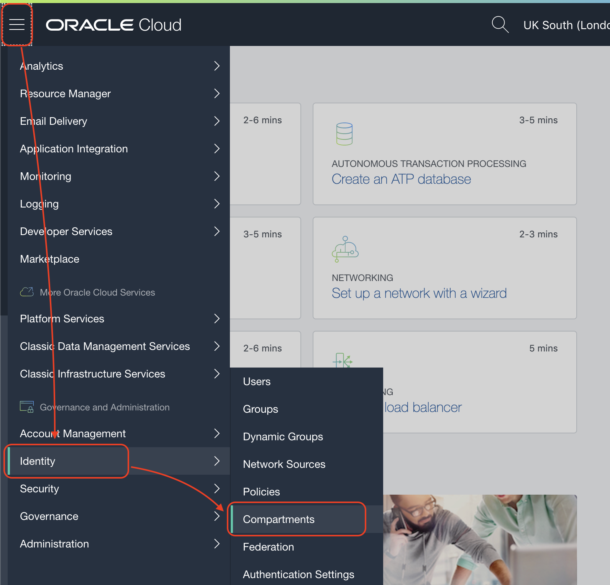
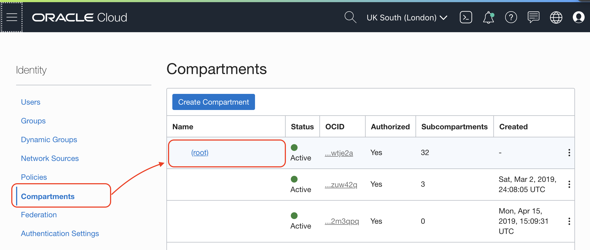

# Lab 600: Programmatically Talking to Oracle Cloud

Orchestrate ATP instances or any other resource in Oracle Cloud using your favourite programming language. SDK sample scripts available for Python, Java and Node.js

## Execute your SDK JAVA app

Download the code

```bash
wget --content-disposition https://github.com/vmleon/OracleATPGettingStarted/blob/master/store/sdkjava.zip?raw=true
```

Unzip the file and change the directory to `java`

```bash
unzip sdkjava.zip

cd sdkjava
```

There is a config file template we need to copy with the proper name to be picked by the application

```bash
cp src/main/resources/config.properties.template src/main/resources/config.properties
```

Edit the file so it match your settings `vim src/main/resources/config.properties`. Make sure you change the `COMPARTMENT_OCID` and `REGION_ID`, everything else should be fine but make sure it match your configuration.

Get this information from




```properties
CONFIG_LOCATION=~/.oci/config
COMPARTMENT_OCID=ocid1.compartment.oc1..blablabla
CONFIG_PROFILE=DEFAULT
REGION_ID=uk-london-1
```

This is a Gradle project, what means we can install dependencies and run the code all in one simple command.

```bash
./gradlew run
```

It will take some time doing the downloads, compilation, etc but you should see something like this, listing the Availability Domains of London region and the list of Autonomous Databases

```bash
uk-london-1 ADs: mDbm:UK-LONDON-1-AD-1, mDbm:UK-LONDON-1-AD-2, mDbm:UK-LONDON-1-AD-3
ATPs: atpworkshop, playground
```

## Explore the code

Feel free to inspect the code on Github in the folder [src/sdkjava](https://github.com/vmleon/OracleATPGettingStarted/tree/master/src/sdkjava).

All the meat is in `src/sdkjava/src/main/java/page/cateam/SDK.java`!

## It works

Well done, you configure the SDK Java app to ask to Oracle Cloud for the list of Availability Domains and the list of Autonomous Databases in a compartment.

You can find information about JAVA SDK and other languages at [Oracle Cloud SDKs Documentation](https://docs.cloud.oracle.com/en-us/iaas/Content/API/Concepts/sdks.htm)

Congratulations! You have finish the workshop! Go to appendix for some extra information and much more content available.

---

[**<< Prev**](../lab500/README.md) | [home](../README.md) | [**APPENDIX >>>>>**](../appendix/README.md)
